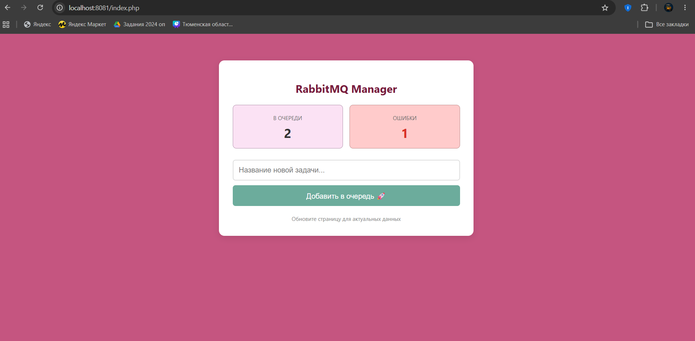

# Лабораторная работа №7: Асинхронная обработка данных через очереди сообщений (RabbitMQ / Kafka)
Научиться работать с очередями сообщений и реализовывать асинхронную обработку данных в PHP.
Познакомиться с интеграцией брокеров сообщений RabbitMQ и Apache Kafka через Docker.
Научиться создавать producers (отправители) и consumers (обработчики) задач.

## 💃 Автор
Меркулова Елизавета, ПМ-2

## 🌼 Вариант
10 - RabbirMQ

## 🍽️ Содержимое проекта

```www/send.php``` — страница с отправкой в очередь

```www/worker.php``` — рабочий

```www/index.php``` — основная страница

```docker-compose.yml``` — описание Nginx

```nginx.conf``` — настройка Nginx

```screenshots/``` — скриншоты

## 📸 Скриншоты


## 🎉 Результат
Добавлены обе системы в docker-compose. Реализована обработка ошибок. Создан интерфейс
